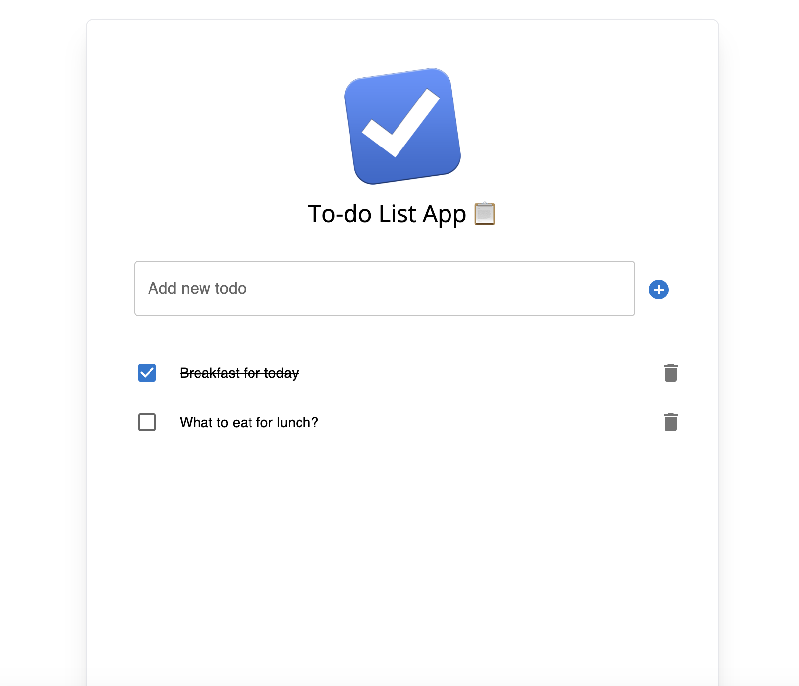

# To-do List app

## React + Vite + Tailwindcss + MUI

### Preview

**Getting Started**

    npm install

and after that start the dev server

    npm run dev

\*\* Please note, this project is already set to use node version `v20.9.0`,

**Packages used**

- TailwindCss
- MaterialUI

---

This template provides a minimal setup to get React working in Vite with HMR and some ESLint rules.

Currently, two official plugins are available:

- [@vitejs/plugin-react](https://github.com/vitejs/vite-plugin-react/blob/main/packages/plugin-react/README.md) uses [Babel](https://babeljs.io/) for Fast Refresh

- [@vitejs/plugin-react-swc](https://github.com/vitejs/vite-plugin-react-swc) uses [SWC](https://swc.rs/) for Fast Refresh
